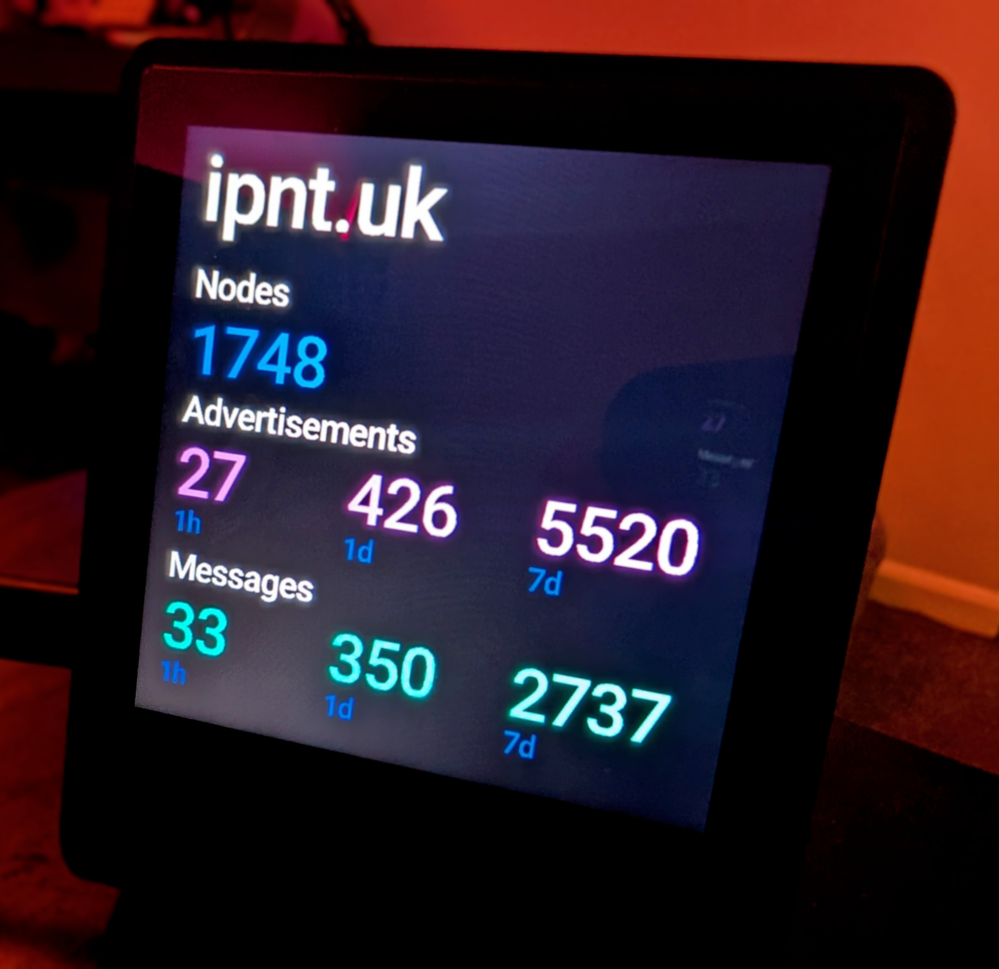

# Presto Prometheus

A Prometheus dashboard for the [Pimoroni Presto](https://shop.pimoroni.com/products/presto) display, rendering MeshCore network metrics from a Prometheus-compatible endpoint.



## Display

The dashboard shows three metric groups:

| Section            | Metrics               | Color |
| ------------------ | --------------------- | ----- |
| **Nodes**          | Total connected nodes | Blue  |
| **Advertisements** | 1h / 24h / 7d windows | Pink  |
| **Messages**       | 1h / 24h / 7d windows | Teal  |

Metrics are refreshed from the Prometheus API every 60 seconds.

## Requirements

- Pimoroni Presto (RP2350-based display)
- [Presto MicroPython firmware](https://github.com/pimoroni/presto) with `picovector` support
- Wi-Fi connectivity
- A Prometheus server exposing `meshcore_*` metrics

## Setup

1. Clone or copy the project files onto the Presto:

   ```
   main.py
   roboto-medium-symbols.af
   ```

2. Create a `secrets.py` in the project root with your Wi-Fi credentials:

   ```python
   WIFI_SSID = "your-ssid"
   WIFI_PASSWORD = "your-password"
   ```

3. Configure the Prometheus endpoint in `main.py` if needed:

   ```python
   PROMETHEUS_URL = "https://metrics.example.com"
   ```

4. Power on the Presto — the script runs automatically via `main.py`.

## Configuration

| Constant           | Default                   | Description                    |
| ------------------ | ------------------------- | ------------------------------ |
| `PROMETHEUS_URL`   | `https://metrics.ipnt.uk` | Prometheus server base URL     |
| `QUERY`            | `meshcore_*` regex        | PromQL query string            |
| `REFRESH_INTERVAL` | `60`                      | Seconds between metric fetches |

## Expected Metrics

The dashboard queries the following Prometheus metric names:

- `meshcore_nodes_total` — current node count
- `meshcore_advertisements_received` — with `window` label (`1h`, `24h`, `7d`)
- `meshcore_messages_received` — with `window` label (`1h`, `24h`, `7d`)

## Project Structure

```
presto-prometheus/
├── main.py                    # Application entry point
├── secrets.py                 # Wi-Fi credentials (gitignored)
├── roboto-medium-symbols.af   # Vector font file
├── docs/
│   └── graphics.md            # Presto graphics API reference
└── LICENSE                    # GPL-3.0
```

## License

[GPL-3.0](LICENSE)
